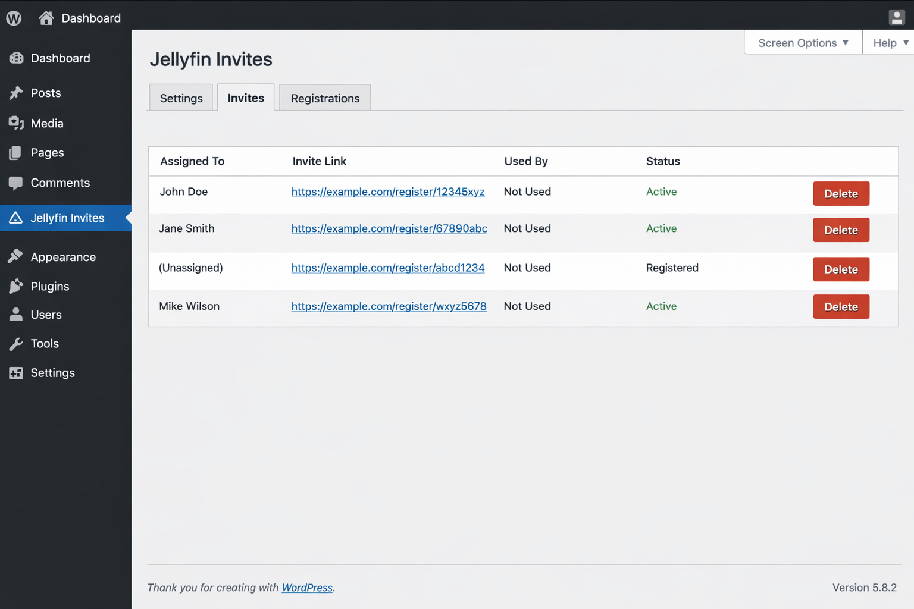

# Jellyfin Invite Theme

**Beta release:** `v0.7.0-beta.1`  
**Created by Erik Woll**

A WordPress theme for invite-based Jellyfin account registration.

## Features

- Create invite links from WordPress admin
- Public registration page via shortcode
- Automatic Jellyfin user creation
- Invite tracking
- Registration logging
- Invite link visibility in admin
- English UI in the theme/admin
- Help text and tooltips in the invite panel

## Requirements

- WordPress
- Jellyfin server
- A Jellyfin API key
- A WordPress page containing:

```text
[jellyfin_invite_signup]
```
## 📸 Screenshot



## Installation

1. Upload the theme ZIP in WordPress.
2. Activate the theme on the correct site.
3. Go to **Appearance → Jellyfin Invites**.
4. Fill in:
   - Jellyfin URL
   - Jellyfin API Key
   - Invite Page ID
5. Save settings.
6. Create a new invite.

## Suggested versioning

This project uses Semantic Versioning with pre-release tags.

Examples:
- `0.7.0-beta.1`
- `0.7.0-beta.2`
- `0.7.0`
- `0.7.1`
- `0.8.0`

## License
MIT

